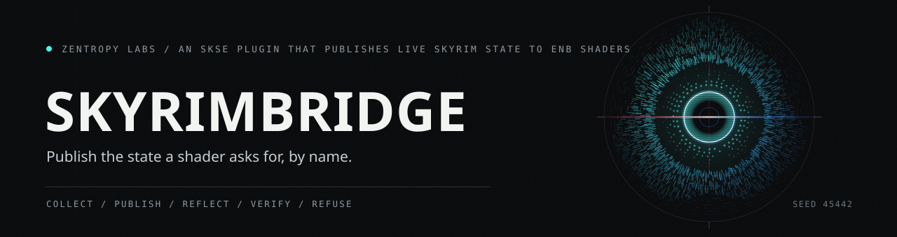

# SkyrimBridge



An SKSE plugin that opens the Skyrim engine to shaders, tools, and creators.
It publishes live game state to ENB every frame, edits engine records while
the game runs, imports foreign texture and model files into formats the game
loads natively, generates collision, and exposes a diagnostics and automation
channel that external tools can drive.

Built on CommonLibSSE-NG with version-independent addressing, so one build
runs on Skyrim Special Edition, Anniversary Edition, and VR. Every write to
the running engine is typed access through the game's own structures, never a
raw memory poke, and the features that change engine state ship turned off
until you enable them.

## What it does

SkyrimBridge is several tools in one plugin. Use only the parts you need.

**For ENB preset authors**
- Publishes over 20 domains of live game state as ENB parameters every frame:
  weather colors, sun and moon, fog, camera, combat intensity, equipment,
  actor values and skills, damage and vision effects, interior state, nearby
  lights, and more. A stable HLSL header (`shaders/SkyrimBridge.fxh`) is the
  contract preset authors read.
- A live weather workshop captures the active weather record, applies edits
  back to the running game, and hot-reloads per-weather preset files while you
  play. No editor, no restart.
- Runtime write-back maps a measured value, a fixed number, or a live ENB
  shader parameter onto an engine target (camera field of view, fog, light
  color, actor values, timescale, game hour), so a slider in the ENB editor
  can drive the engine in real time.
- A GPU tier with a physically based atmosphere renderer and raymarched
  volumetric clouds, for setups that chain a D3D11 proxy.


**For non-ENB shader and framework authors**
- In-process consumers can resolve `SB_GetBridgeInterface` from
  `SkyrimBridge.dll` at runtime and read the published frame state through a
  versioned ABI without linking against SkyrimBridge. Treat it as optional: if
  the DLL, symbol, version, layout, or current frame is unavailable, fall back
  to your own data path. See [docs/BRIDGE-ABI.md](docs/BRIDGE-ABI.md).

**For record and worldspace editors**
- EngineReflect reads any of 14 record types to a plain text file, lets you
  edit it, and writes it back with a round-trip check: image spaces, weathers
  (the full 487-field record), climates, lighting templates, water, effect
  shaders, lights, regions, worldspaces, grass, land textures, trees, and
  more. 827 fields in total, all named.
- SkyrimBridge detects the original Kitsuune ENB plugins when they are present
  and defers to them. The public archive does not contain SkyrimBridge's
  private native replacement-suite implementation; use the original plugins
  for those features.

**For texture and model creators**
- A foreign texture pipeline: decode PNG, TGA, and BMP, and read and write DDS
  in BC1, BC3, BC7, BC4, and BC5. It can transcode a whole texture tree at
  load, or convert a missing DDS in flight and serve it through the engine's
  own file stream. Mipmap generation includes an alpha coverage preserving
  mode so foliage does not thin out at distance.
- A foreign model pipeline: convert OBJ, glTF, and GLB static meshes to
  Skyrim SE NIF, place them in the running game through the engine's own
  loader, and paint procedural tree wind weights so a converted tree sways.
- Collision generation: a convex hull, an approximate convex decomposition
  for concave shapes, and exact mesh collision built from the reversed
  compressed-mesh format, with selectable Havok materials so a snow prop
  sounds like snow underfoot.
- A Blender add-on that exports the selected mesh and drops it into the
  running game with one click, over the command channel below.

**For power users and troubleshooters**
- A cell performance census names the shadow-casting lights in your current
  cell, ranked by distance, with the plugin that placed each one. The manual
  hunt for a frame-rate sink becomes one command.
- A live Papyrus virtual machine monitor reports script load while the game
  runs: the function-message queue depth, running and frozen stacks, which
  scripts are executing right now, and the per-script instance census.
- A command channel over shared memory lets an external tool drive the engine
  surface without the console. A command-line client, the Blender add-on, and
  a modlist smoke-tour tester all speak it.


## Requirements

- Skyrim Special Edition, Anniversary Edition, or VR
- [SKSE64](https://skse.silverlock.org/) (or SKSEVR)
- [Address Library for SKSE Plugins](https://www.nexusmods.com/skyrimspecialedition/mods/32444)
- [ENBSeries](http://enbdev.com/), for the shader-facing features only
- [ConsoleUtilSSE](https://www.nexusmods.com/skyrimspecialedition/mods/76649),
  optional, for calling the console functions with `cgf`

The record editing, texture, model, collision, and diagnostics features do
not require ENB. The ENB parameter publishing and the shader-facing write-back
do.

## Installation

Install it like any SKSE plugin. A mod manager is recommended.

**With a mod manager (Mod Organizer 2 or Vortex)**
1. Download the release archive.
2. Install it in your mod manager and enable it, the same as any other mod.
3. Make sure SKSE, Address Library, and (for the shader features) ENBSeries
   are installed and enabled.
4. Launch through SKSE.

**Manual install**
1. Extract the archive into your Skyrim `Data` folder, so that the plugin
   lands at `Data/SKSE/Plugins/SkyrimBridge.dll` and its config files land in
   `Data/SKSE/Plugins/SkyrimBridge/`.
2. Launch through SKSE.

**The GPU tier (optional)**
The atmosphere and cloud renderer needs the bundled `d3d11.dll` proxy. Place
it next to `SkyrimSE.exe`, or chain it through ENB by setting
`ProxyLibrary` in the `[PROXY]` section of `enblocal.ini`. Without the proxy
the GPU tier stays dormant and the rest of the plugin works normally. See
[docs/GPU.md](docs/GPU.md).

**Verify it loaded**
After a launch, check for `SkyrimBridge.log` in
`Documents/My Games/Skyrim Special Edition/SKSE/`. The first lines report the
plugin version and the features that initialized.

## First steps

- ENB preset authors: read [docs/parameters.md](docs/parameters.md) for the
  parameter contract, then include `shaders/SkyrimBridge.fxh` in your effect
  file.
- Everyone else: the full feature reference, with every console command,
  config key, and command-channel verb, is in
  [docs/USER-GUIDE.md](docs/USER-GUIDE.md). The technical specification is in
  [docs/SPEC-ENGINE-EXPOSURE.md](docs/SPEC-ENGINE-EXPOSURE.md).

Everything that writes to the running engine ships disabled. You turn on each
feature deliberately, in its config file or with a console command, after
reading what it does.

## Configuration

The plugin reads plain INI files from `Data/SKSE/Plugins/SkyrimBridge/`:

| File | Controls |
|---|---|
| `SkyrimBridge.ini` | Core plugin toggles, texture pipeline options, and command-channel features |
| `WeatherParams.ini` | The weather parameter mapping published to ENB |
| `WriteBackConfig.ini` | The write-back rules from parameters to engine targets |
| `GPU.ini` | The GPU rendering tier |

Each file is commented, and every feature that changes engine state defaults
to off.

The public archive intentionally does not ship `Sky.ini` or
`WeatherRouting.example.ini`; those belong to the private native replacement
suite that is excluded from public packages.

## Building from source

A standard CommonLibSSE-NG plugin build through vcpkg:

```
cmake -B build -S . -DCMAKE_TOOLCHAIN_FILE=<path-to-vcpkg>/scripts/buildsystems/vcpkg.cmake
cmake --build build --config Release
```

The `commonlibsse-ng` dependency resolves through the vcpkg manifest
(`vcpkg.json`) in this repository. The output is `SkyrimBridge.dll`. The
optional D3D11 proxy builds as `d3d11.dll` from the same tree.

Public builds are the default: `SKYRIMBRIDGE_NATIVE_REPLACEMENTS` is `OFF`
unless a private operator build explicitly configures it `ON`.

## Repository layout

| Path | Contents |
|---|---|
| `src/core/` | The plugin: trackers, engine access, the texture, model, collision, and codec modules, and the Papyrus bridge |
| `src/` | Weather parameter computation, the shared-memory channel, and the enbParmLink compatibility layer |
| `src/d3d11_proxy/` | The standalone D3D11 proxy for the GPU tier |
| `shaders/` | The stable HLSL headers for preset authors |
| `config/` | The default configuration files |
| `docs/` | User guide, parameter contract, and technical specifications |
| `tools/` | The Blender add-on, the command-line client, and the smoke-tour tester |
| `tests/` | Offline validation harnesses for the codecs and formats |

## Verification


The file-format and codec work is validated offline against real game assets,
with 21 re-runnable harnesses in `tests/`. Each checks its output against an
independent decoder or against the game's own files. The features that write
to the running engine are validated in-game; the acceptance steps are in
[docs/VALIDATION-PROTOCOL.md](docs/VALIDATION-PROTOCOL.md).

## License

MIT. Copyright 2026 Zain Dana Harper. Use it, ship presets and tools on it,
and build against the command channel and the HLSL contract.

## Credits

Built on [CommonLibSSE-NG](https://github.com/CharmedBaryon/CommonLibSSE-NG).
The BC7 texture tables are extracted from Microsoft DirectXTex (MIT). The
weather and record work builds on the collective reverse-engineering of the
Skyrim modding community.
